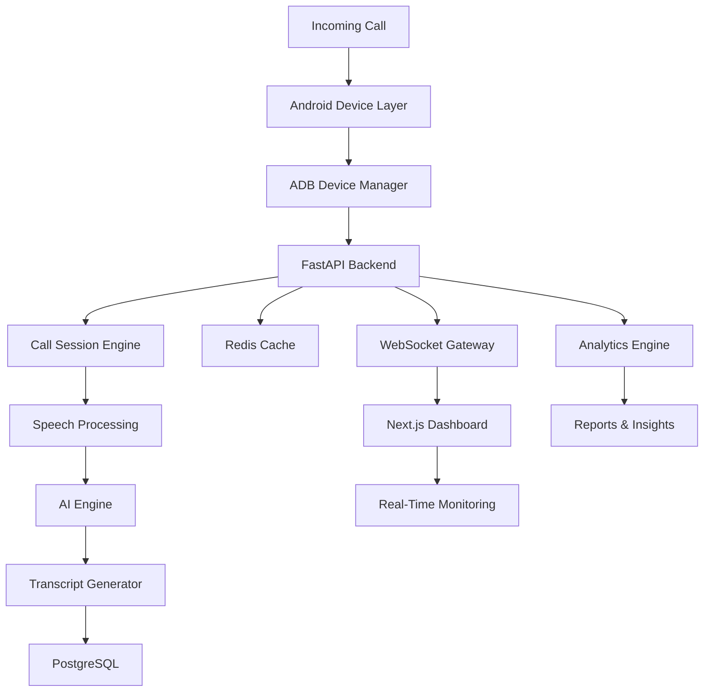

# 🚀 AI Calling System

<div align="center">


### Enterprise-Grade AI Voice Communication Platform

AI-Powered Calling • Android Device Orchestration • Real-Time Monitoring • Multi-Device Scaling • Production Infrastructure


</div>

---

# 🌟 Overview

AI Calling System is a production-ready intelligent voice communication platform designed to automate inbound and outbound call workflows using advanced AI technologies.

The platform combines:

* 🤖 AI-Powered Voice Processing
* 📞 Automated Call Handling
* 📱 Android Device Management
* 🎙 Real-Time Speech Processing
* 📝 Intelligent Transcript Generation
* 📊 Live Monitoring Dashboard
* 🔄 Multi-Device Scalability
* 🐳 Containerized Deployment

Built for organizations that require reliable, scalable, and intelligent call automation infrastructure.

---

# 🎯 Core Capabilities

## 🤖 AI Intelligence Layer

* Real-Time Call Analysis
* AI Conversation Engine
* Smart Response Generation
* Context-Aware Conversations
* Intent Detection
* Call Summarization
* Transcript Generation
* Conversation History

---

## 📞 Call Management

* Incoming Call Processing
* Outgoing Call Automation
* Call Session Tracking
* Call Recording Support
* Call Routing Engine
* Live Call Monitoring
* Multi-Session Support

---

## 📱 Android Device Layer

* ADB Integration
* Device Registry Management
* USB Device Detection
* Device Health Monitoring
* Device Assignment Engine
* Auto Reconnection
* Multi-Device Management

---

## 📊 Analytics & Monitoring

* Real-Time Dashboard
* Active Session Tracking
* Call Analytics
* Device Monitoring
* System Health Metrics
* Performance Insights
* Usage Statistics

---

## 🔐 Enterprise Security

* JWT Authentication
* Refresh Token System
* Password Hashing
* Role-Based Access Control
* API Security
* Rate Limiting
* Input Validation
* CORS Protection
* Audit Logging

---

# 🏗 System Architecture



---

# ⚙ Technology Stack

## Frontend

```text
Next.js 15
TypeScript
Tailwind CSS
ShadCN UI
React Query
Zustand
Axios
Socket.IO Client
```

---

## Backend

```text
FastAPI
Python 3.12
SQLAlchemy 2.0
Alembic
Pydantic
PostgreSQL
Redis
WebSockets
```

---

## AI Services

```text
OpenAI
Ollama
Whisper STT
Edge TTS
Conversation Memory
Prompt Orchestration
Transcript Processing
```

---

## DevOps & Infrastructure

```text
Docker
Docker Compose
NGINX
GitHub Actions
CI/CD Pipelines
Monitoring Stack
Linux Deployment
```

---

# 📂 Project Structure

```text
AI-Calling-System/

├── frontend/
│
│   ├── app/
│   ├── components/
│   ├── hooks/
│   ├── services/
│   ├── stores/
│   ├── lib/
│   └── utils/
│
├── backend/
│
│   ├── api/
│   ├── core/
│   ├── models/
│   ├── schemas/
│   ├── repositories/
│   ├── services/
│   ├── middlewares/
│   ├── websocket/
│   └── database/
│
├── ai-services/
│
│   ├── stt/
│   ├── tts/
│   ├── llm/
│   ├── memory/
│   └── transcripts/
│
├── docker/
│
├── scripts/
│
├── docs/
│
└── deployment/
```

---

# 🚀 Quick Start

## Clone Repository

```bash
git clone https://github.com/Ritesh151/AI-Calling-Agent---Client-Communication.git

cd AI-Calling-Agent---Client-Communication
```

---

# 🐳 Docker Deployment

## Start Entire Platform

```bash
docker compose up -d --build
```

---

## Check Containers

```bash
docker ps
```

---

## View Logs

```bash
docker compose logs -f
```

---

# 🔧 Backend Setup

```bash
cd backend

python -m venv venv

source venv/bin/activate
```

Install Dependencies

```bash
pip install -r requirements.txt
```

Database Migration

```bash
alembic upgrade head
```

Run Server

```bash
uvicorn app.main:app --reload
```

---

# 🎨 Frontend Setup

```bash
cd frontend

npm install

npm run dev
```

---

# 🗄 Database Stack

## PostgreSQL

Stores:

* Users
* Call Sessions
* Transcripts
* Analytics
* Devices
* Audit Logs

---

## Redis

Used For:

* Session Management
* Queue Processing
* Cache Layer
* Real-Time Events
* Background Jobs

---

# 📡 API Features

```text
Authentication APIs
Call Management APIs
Device APIs
Analytics APIs
Transcript APIs
Monitoring APIs
Admin APIs
```

---

# 🔄 Application Workflow

```text
Incoming Call

↓

Android Device

↓

ADB Detection

↓

Backend Processing

↓

AI Analysis

↓

Transcript Generation

↓

Database Storage

↓

Live Dashboard Update

↓

Analytics Processing
```

---

# 📈 Repository Analytics

<div align="center">


</div>

---

# 🔥 Contribution Activity

<div align="center">


</div>

---

# 🐍 Contribution Snake

<div align="center">


</div>

---

# 🚀 Production Readiness

### Supported Features

* Dockerized Deployment
* CI/CD Compatible
* Horizontal Scaling
* Health Checks
* Monitoring Support
* Database Migration System
* Real-Time Communication
* Secure Authentication
* Enterprise Architecture

---

# 📜 License

MIT License

---

# 👨‍💻 Developed By

## Ritesh Gajjar

Senior Software Developer

AI Systems • Automation • Voice Infrastructure • Scalable Backend Architecture

<div align="center">


</div>
